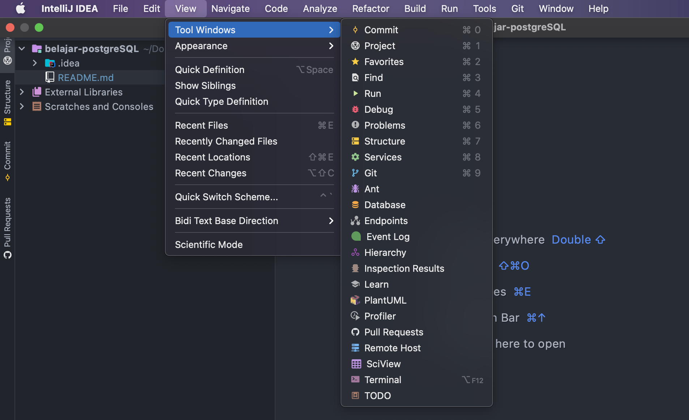
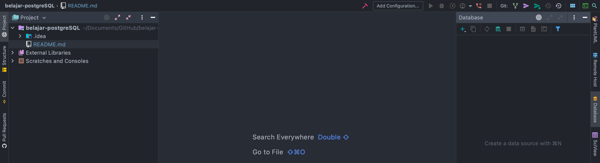
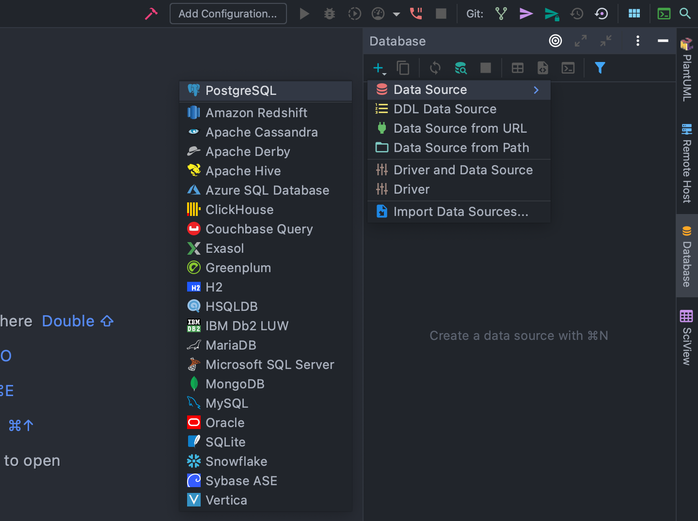
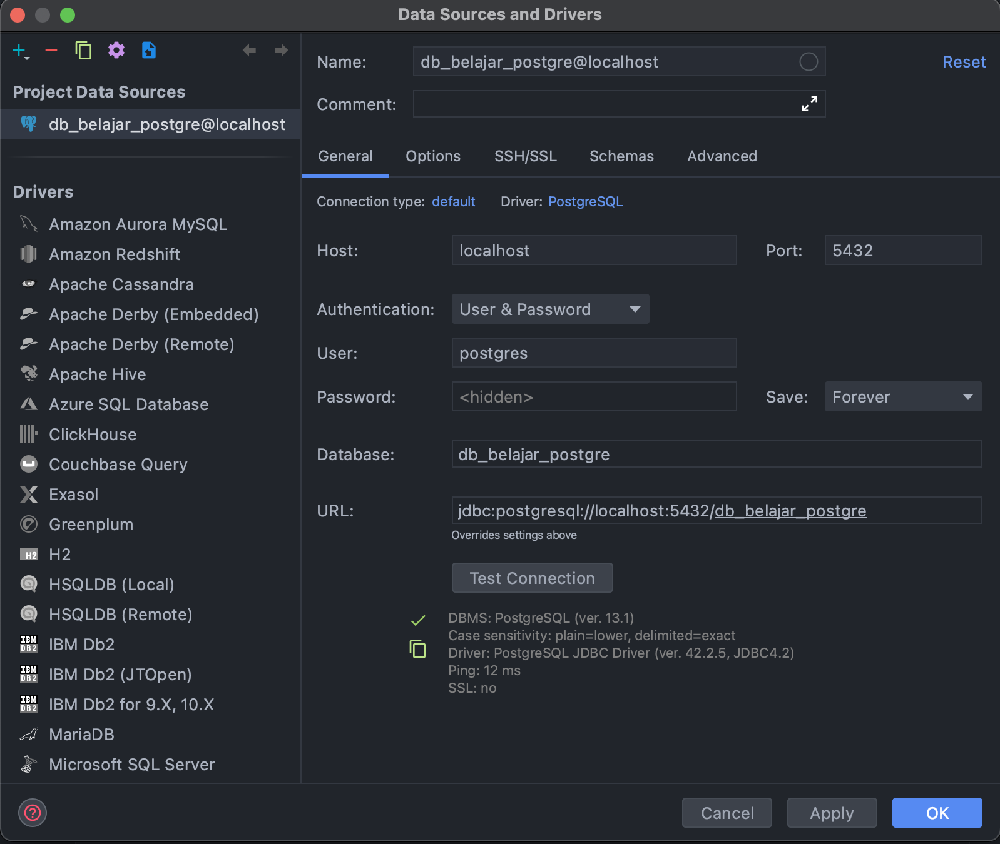
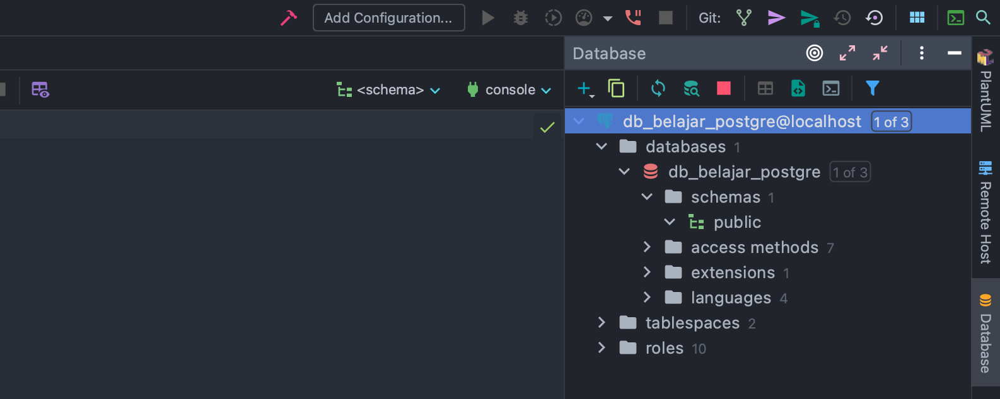

## Belajar Postgre SQL

### Instalasi Postgre SQL
1. Untuk instalasi banyak cara, untuk yang paling mudah adalah dengan menggunakan installer yang sudah di sediakan oleh postgre itu sendiri. Buka website ini https://www.postgresql.org/download/ sesuaikan dengan sistem operasi yang anda gunakan saat melihat dokumentasi ini.
2. Disini saya menggunakan OS X, instalasi yang saya lakukan adalah dengan menggunakan homebrew.
3. Instalasi PosgreSQL
    ```
    brew install postgresql
   ```
   Menjalankan postgreSQL
    ```
   pg_ctl -D /usr/local/var/postgres start && brew services start postgresql
   ```
   cek versi
    ```
   postgres -V
   ```
4. Selesai


### Konfigurasi Postgre SQL
1. Buka terminal, lalu jalankan ini:
    ```
   psql postgres
   ```
   Jika berhasil menjadi:
    ```
   postgres=# 
   ```
2. Cek user yang tersedia:
    ```
   postgres=# \du
   ```
3. Membuat User Baru (Owner)
    ```
   create role postgres with password 'postgres' Createdb, Login;
   ```
4. Masuk dengan user yang spesifik
    ```
   psql -U postgres -d postgres -p 5432 -h localhost;
   ```


### DDL Postgre SQL
1. Membuat database
    ```
   create database db_name;
   ```
2. List database berikut dengan owner nya
    ```
   \l
   ```
3. Untuk mengubah owner dari database yang di buat
   ```
   alter database db_name owner to owner_name;
   ```
4. Untuk dapat menggunakan database yang telah di buat
    ```
   \c db_name ownername
   ```
5. Setelah masuk, untuk melihat daftar table dapat menggunakan
    ```
   dt
   ```
6. Clear command line
    ```
   \! clear
   ```
7. Keluar dari database yang digunakan saat ini
    ```
   \q
   ```

Untuk memudahkan dalam operasi DDL maupun DML kalian dapat menggunakan tool bawaan postgre itu sendiri yaitu pgAdmin, URL: https://www.pgadmin.org/download/

Tetapi disini, saya menggunakan Intellij IDEA versi Ultimate.

Untuk mengkoneksikan database postgreSQL dengan Intellij dapat kalian ikuti cara di bawah ini:
1. Buka intellij, kemudian atur terlebih dahulu seperti ini, silahkan pilih ***database***
   
2. Jika sudah, silahkan klik database yang ada di pojok kanan
   
3. Buat Data Source baru, dengan mengkil **Data Source**, kemudian pilih database **PostgreSQL**
   
4. Silahkan isi sesuai dengan user dan database yang telah di buat, lakukan **Test Connection**
   
5. Setelah berhasil terkoneksi maka akan muncul seperti ini:
   
6. Untuk list table berada pada **public**   


### Tipe Data
